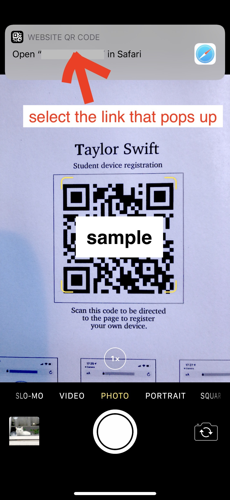
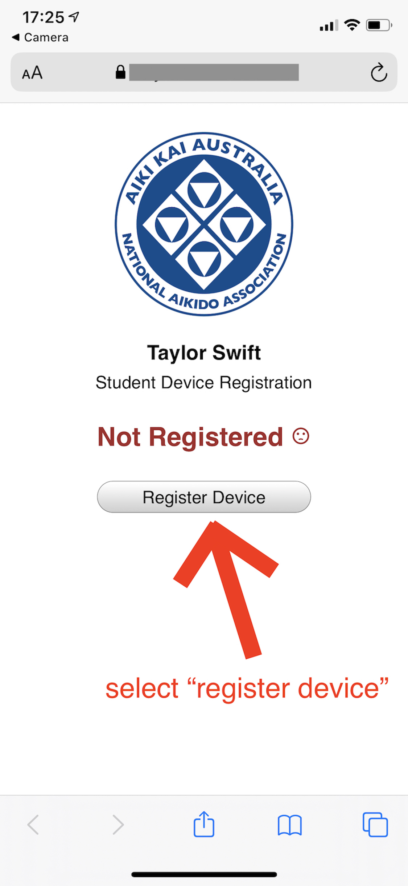
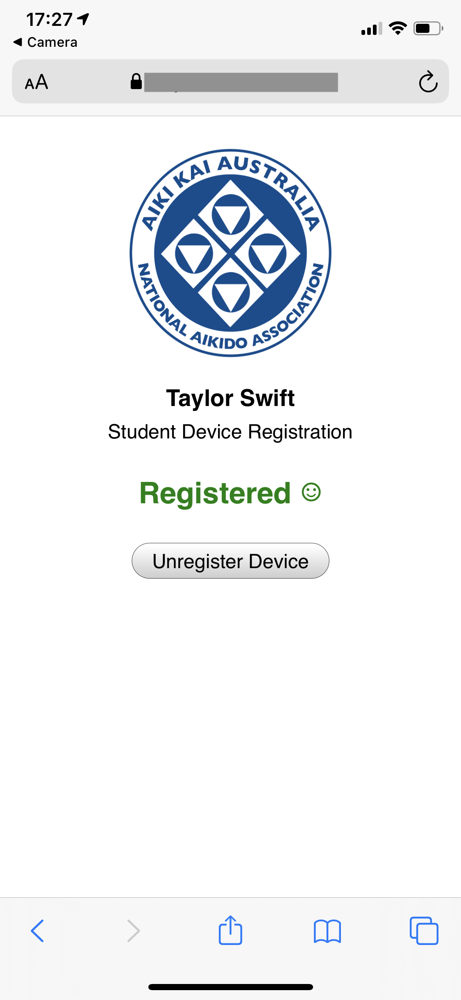

Aiki Dojo
=========

Aiki Dojo is web based attendance tracking system for martial arts and similar  organisations. It records information about people, events, and which people attended those events. Attendance information can be added to the system by use of a QR code systems, as well as directly via the web interface.

Student Workflows
-----------------

Students must first register their phones with the system by scanning a personal registration QR code. Once the phone is registered they can then scan the class code.

Student Registration
********************

0. The student's name and contact details must first be added to the system by an instructor or site adminstrator, which is described in the next section.

1. The student (here, Taylor) uses their phone to scan their own personal student registration QR code.

2. The student registration code directs the phone to the attendance server, which shows a page to register the phone as belonging to this student.

3. The student clicks a button on the registration page, which makes the server provide a cookie (a special code) that contains their Aikikai identification number. The phone stores this cookie, and will give a copy back to the server if later requested.

Students should typically only need to perform this registration process once. They may need to register again if they change phones, or if they instruct the web browser on their phone to clear the cookies it is holding.

The student registration code can either be given to the student on a printed form, or scanned directly from an instructor's phone while the instructor is accessing the web interface. In the web interface the registration code for a particular student is accessible via [People -> Student Name -> Device.Reg]. The student can either scan the code that appears on this page with their own phone, or the instructor can print or email the form accessible via the link at the bottom of the same page via [Registration PDF download].

Class Registration
******************

1. When the student attends a class they use their phone to scan a different class registration QR code.

2. The class registration code directs the phone back to the attendance server.

3. The server requests a copy of the cookie provided previously, which it uses to determine which student is connecting to it.

4. The server shows a page with a button to add the student to the attendance list for the class.

5. The student clicks the button to have their name added to the list.